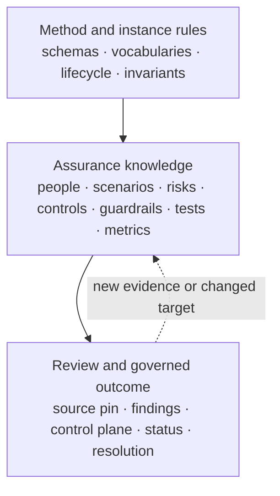
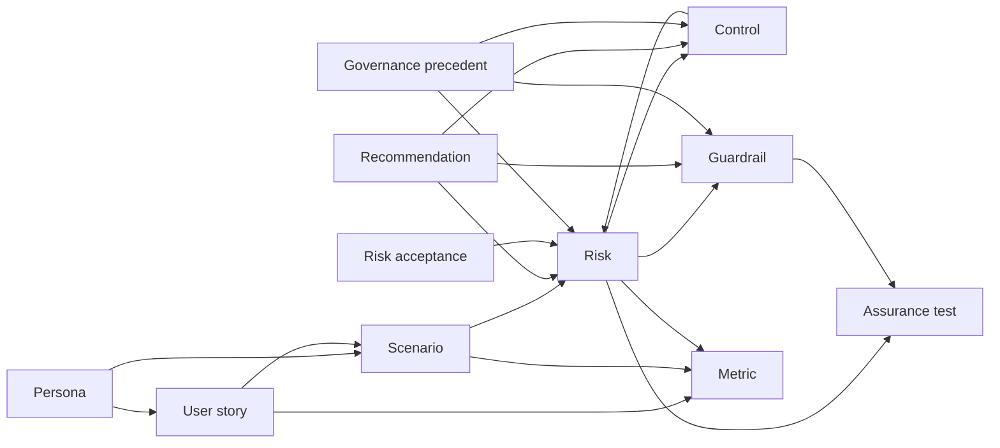
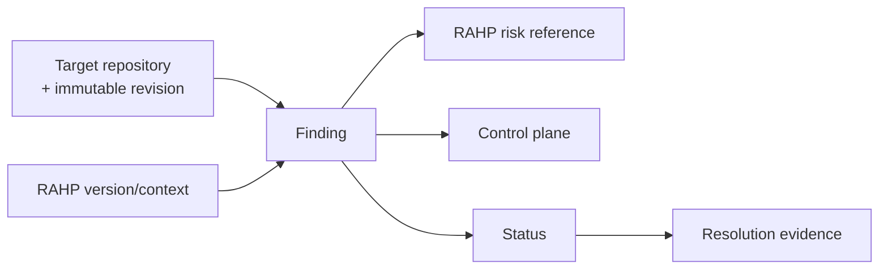

# RAHP data model

This page is a reader-facing map of the RAHP records in this repository and the relationships among them. It introduces no new RAHP semantics.

Where this explanation differs from a machine-readable schema, controlled vocabulary, lifecycle record, instance declaration, or specification-review schema, the machine-readable repository artifact is authoritative.

## Current authority surfaces

At the current repository revision, the principal machine-readable surfaces are:

- `method/schema/rahp.schema.json` for RAHP record structures;
- `method/vocabularies.yaml` for controlled values and definitions;
- `method/lifecycle.yaml` for the RAHP standards-development lifecycle;
- `data/instance.yaml` for identifier namespaces, cross-reference edges, and repository invariants;
- the YAML record files under `data/` for the current DTG instance; and
- `review/spec-review.schema.json` for reproducible specification-review records.

Some existing comments and documentation describe a future or intended `method/`, `data/`, and `tools/` layout. This page describes the repository as it exists now and does not treat those paths as already implemented.

## Three connected views

RAHP is easier to read as three connected views rather than as one monolithic object.

### 1. Method and instance rules

The method-level records define how RAHP objects are structured, named, related, and validated.

`method/schema/rahp.schema.json` defines structural record schemas.

`method/vocabularies.yaml` defines controlled values such as severity, likelihood, standards priority, control type, persona type, and risk-acceptance decision.

`method/lifecycle.yaml` describes the standards-development lifecycle. It identifies stages, required outputs, evidence expectations, invariants, and known method gaps.

`data/instance.yaml` binds the current DTG instance to identifier namespaces and cross-reference rules. It also records invariants that the validator is expected to enforce.

These surfaces should be read together. A schema defines shape, a vocabulary constrains meaning, the lifecycle explains method intent, and the instance declaration describes how the current corpus is wired.

### 2. Assurance knowledge

The current DTG instance is a linked corpus rather than a set of independent lists.

The principal record families are:

| Prefix | Record | Current source |
|---|---|---|
| `PERSONA` | Persona | `data/personas.yaml` |
| `US-*` | User story | `data/user-stories.yaml` |
| `SC-*` | Scenario | `data/scenarios.yaml` |
| `RK-*` | Risk | `data/risks.yaml` |
| `CT-*` | Control | `data/controls.yaml` |
| `GR-*` | Guardrail | `data/guardrails.yaml` |
| `AT-*` | Assurance test | `data/assurance-tests.yaml` |
| `M-*` | Metric | `data/metrics.yaml` |
| `EPIC-*` | Capability cluster | `data/epics.yaml` |
| `REC-*` | Recommendation | `data/recommendations.yaml` |
| `RA-*` | Risk acceptance | `data/risk-acceptances.yaml` |
| `GP-*` | Governance precedent | `data/governance-precedents.yaml` |

The cross-reference rules in `data/instance.yaml` are the clearest machine-readable map of how these families may link.

A useful explanatory view is:

This diagram is explanatory. `data/instance.yaml` remains authoritative for the actual permitted cross-reference fields.

## Core relationships and invariants

The current instance declares several important relationships explicitly.

### Risks connect harms to treatment and observation

A risk may reference:

- affected metrics;
- user stories;
- scenarios;
- guardrails;
- controls;
- assurance tests; and
- capability clusters.

A risk therefore acts as a central join point between context, harm analysis, mitigation, verification, and observation.

### Controls reduce risk but do not act as phase gates

Controls link to risks and may also reference guardrails.

The repository distinguishes controls from guardrails. Controls reduce likelihood or impact. Guardrails are hard-stop conditions for progression.

### Guardrails must be testable

`data/instance.yaml` declares the invariant:

> A guardrail without an assurance test is unverifiable.

Every guardrail is therefore expected to have at least one linked assurance test.

### Controls must remain observable

The current instance also declares:

> A control without a metric linkage is unmonitorable.

That linkage may be transitive through a risk. A control can therefore satisfy the invariant when a risk it addresses has an affected metric.

### Critical risks are not ordinary high-scoring risks

The controlled vocabulary treats `Critical` as an absolute category rather than a larger number on the same scale.

The instance declares that a Critical risk must have a guardrail and may not be risk-accepted.

### Recommendations are action proposals, not authority

Recommendations may link to risks, controls, and guardrails. They identify proposed action against the target specification, but the existence of a recommendation does not itself make that proposal authoritative.

## Governance records

RAHP distinguishes assurance analysis from governance authority.

### Risk acceptance

`data/risk-acceptances.yaml` records residual-risk decisions or pending decisions.

At the current repository state, the seeded records remain `pending` because the task force has not yet established who may accept risk, under what authority, or against what evidence threshold.

This is also represented as `GAP-3.1` in `method/lifecycle.yaml`.

A risk-acceptance record must therefore not be read as an acceptance merely because the record exists.

### Governance precedent

`data/governance-precedents.yaml` records why a design or governance decision was made so that future contributors can understand the reasoning and evidence behind it.

The current precedents are marked `proposed`, not silently treated as ratified authority.

## Specification-review records

The review capability under `review/` adds a separate execution record for pressure-testing a particular specification revision.

`review/spec-review.schema.json` requires:

- a stable assessment identifier;
- a target repository;
- an immutable 40-hex target revision;
- the RAHP version/context used for review; and
- findings.

Each finding carries:

- a finding identifier;
- a summary;
- one or more RAHP risk references;
- a control-plane classification; and
- a status.

Terminal findings require structured resolution evidence.

The review record does not replace the RAHP corpus. It binds findings from one bounded review to the maintained risk model.

A valid review record means the review metadata is well-formed and reproducibly source-pinned. It does not mean that the target has passed assurance.

## Control plane and status are different dimensions

The specification-review contract deliberately separates:

- **control plane**, meaning where treatment belongs; and
- **status**, meaning what has happened to the finding.

A governance finding can remain open. A specification finding can be resolved. A risk can be formally accepted only when the required authority and evidence are present.

Keeping these dimensions separate prevents RAHP from implying that every valid risk must be solved through normative specification text.

## Provenance and evidence

Most RAHP record schemas support a provenance object with a source and optional import, trigger, contributor, and note fields.

Provenance answers where a record or material change came from.

Evidence answers what supports a proposition or decision.

The two are related but should not be conflated. A source citation may explain why a record exists without proving that a control is effective or that a risk has been accepted.

The specification-review record adds a second provenance boundary by pinning the exact source revision that was reviewed.

## Reading order

For a reader trying to understand the current model, a practical order is:

1. `README.md` for repository orientation;
2. [ADOPTION.md](../ADOPTION.md) for the bounded adoption path;
3. this page for the record relationship map;
4. `method/lifecycle.yaml` for method stages and gaps;
5. `method/schema/rahp.schema.json` for record structures;
6. `method/vocabularies.yaml` for controlled values;
7. `data/instance.yaml` for namespaces, cross-references, and invariants;
8. the relevant root YAML records for the current DTG instance;
9. `docs/pressure-testing-a-spec.md` and `review/spec-review.schema.json` for reproducible specification review.

## Authority boundary

This page is explanatory documentation.

It does not:

- create new record types;
- change a vocabulary;
- alter an invariant;
- assign risk-acceptance authority;
- ratify a governance precedent;
- change the specification-review schema; or
- make generated output authoritative over canonical source records.

When this page and a machine-readable contract differ, use the machine-readable contract and treat the documentation mismatch as a defect to be corrected.
